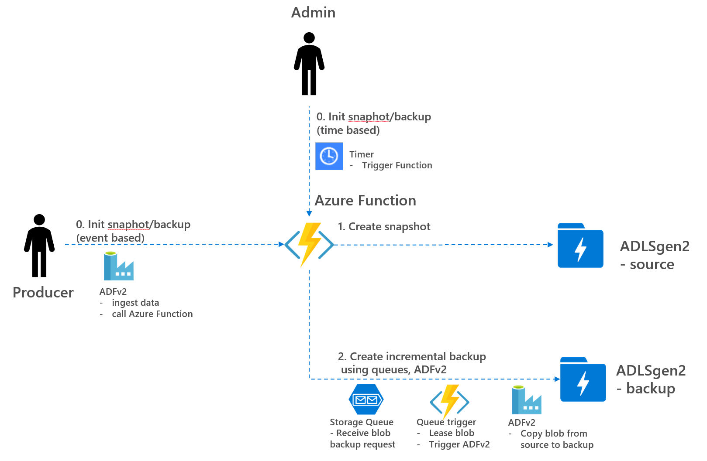

## Datalake snapshots and incremental backups to different storage account
Scripts to support creation of snapshots and incremental backups in a data Lake using principles in this Microsoft article: https://azure.microsoft.com/nl-nl/blog/microsoft-azure-block-blob-storage-backup/. High level overview can be depicted as follows, see also my :

To support data lake snapshots and incremental backup creation, three types of scripts are used:

- Event based script triggered by Producer when data is ingested/modified (see HttpSnapshotIncBackupContainerProducer as Azure Function)
- Time based script triggered by Admin to reconcile missing snapshots/incremental backups (see HttpSnapshotIncBackupStorageReconciliation)
- Queue trigger script that creates incremental backups using ADFv2 (see QueueCreateBlobBackupADFv2)

Notice that [blob snapshots](https://docs.microsoft.com/en-us/rest/api/storageservices/creating-a-snapshot-of-a-blob) are only supported in regular storage accounts and are not yet supported in ADLSgen2 (but is expected to become available in ADLSgen2, too). Scripts are therefore based on regular storage accounts, detailed explanation of the scripts can be found below.

### 1. HttpSnapshotIncBackupContainerProducer
- Script checks for modified/new blobs in a container of a storage account. In case it detects a modified/new blob, it creates a blob snapshot and adds a backup request message to the storage queue. Backup request message only contains metadata of the modified blob. Snapshot creation is a cheap operation O(1) and is done synchroneously by the script, whereas backup creation is an expensive operation and is done asynchroneously using queues and ADFv2. 
- Script shall be run by Producer N that ingests data to container N in the datalake. Typically, this script shall be added as last step in the ADFv2 pipeline that ingests data to the container for the Producer. Only the Producer ADFv2 Managed Identity and this Azure Function Managed Identity have write access to this container. Blob triggers do not work in this scenario, since no events are fired when blobs are modified.

### 2. HttpSnapshotIncBackupStorageReconciliation
- Script checks for modified/new blobs in a container of a storage account. In case it detects a new/modified blob, it creates a blob snapshot. This part is similar as previous script, see next bullet for reconciliation of blob backup.
- Script also checks for blobs that are not yet in the backup storage account. In case it detects that the last version of the blob is not yet in the backup storage account, it adds a backup request message to the storage queue. Backup request message only contains metadata of the modified blob.
- Script shall be run periodically by datalake admin team to reconcile missing snapshots and/or missing backups (e.g. when producer script was not run or failed to run).

### 3. QueueCreateBlobBackupADFv2
- Script that reads backup request messages from the storage queue. In case it detects a message, it calls an ADFv2 pipeline using REST to copy the blob from the storage account to the backup storage account. Using queue triggers and ADFv2, large files can be copied in parallel.
- Script can be run in blob_lease mode which exclusively locks the file and guarantees the correct version of the file is added to backup storage account. Whether or not using blob lease depends on a lot of factors (e.g. max lease time allowed, file size, number of ingestions jobs, immutability).
